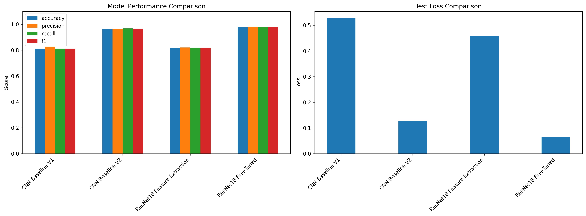
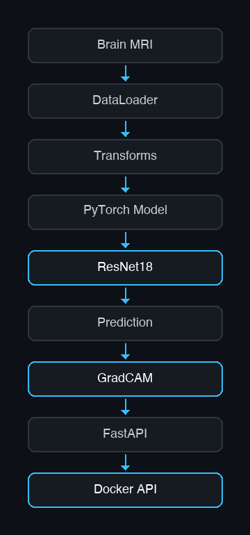
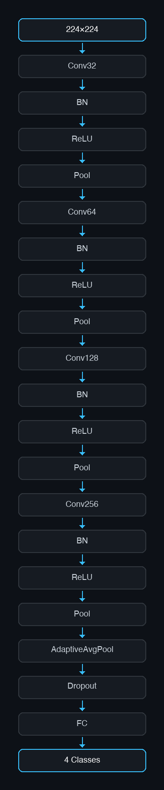
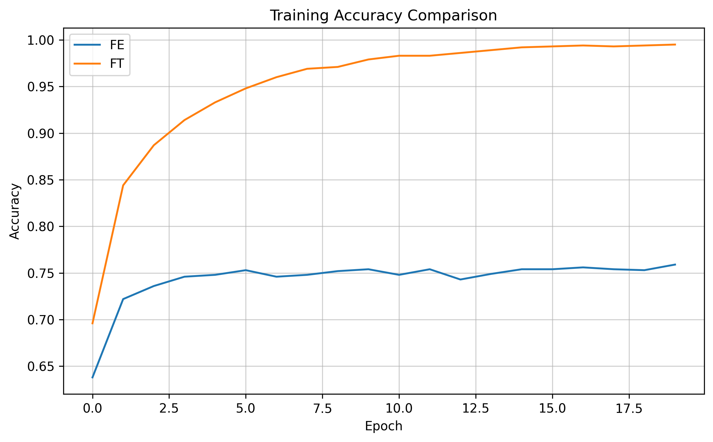
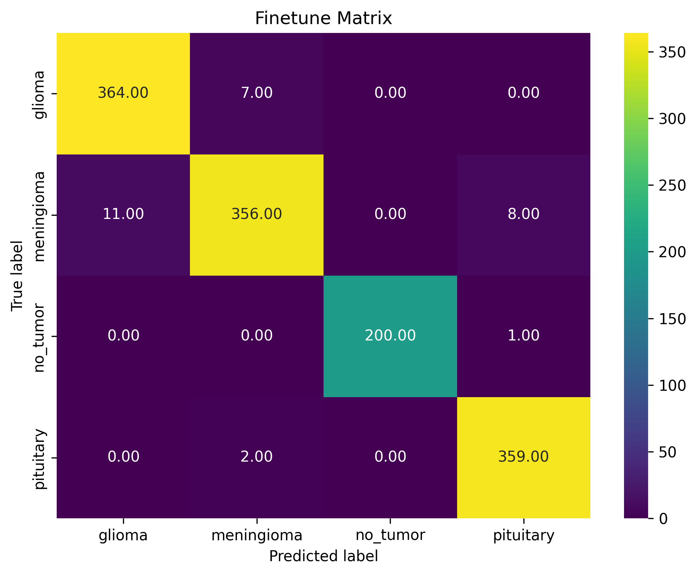
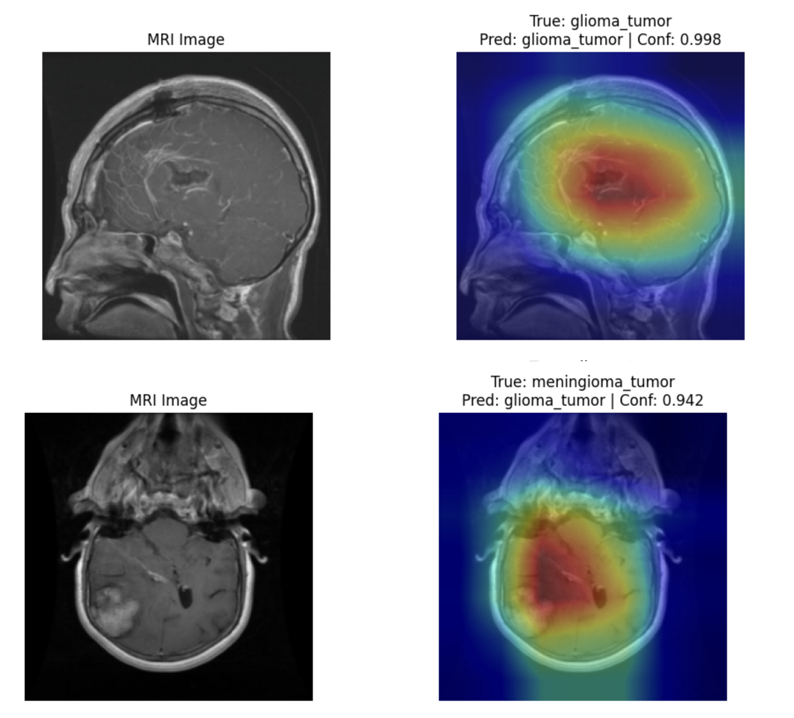

# 🧠 Brain Tumor MRI Classification

<p align="center">
  <!-- Note: Ensure you have a banner.png in your assets folder, or remove this line -->
  
</p>

<p align="center">
  
  
  
  
  
</p>

> **Author:** [Nafise Bahoosh](https://github.com/Nafisioo) | **Portfolio Project**

## 📑 Overview

An end-to-end deep learning pipeline for **4-class brain MRI classification** built with PyTorch. This project bridges the gap between research and production by implementing a complete machine learning lifecycle: starting from custom baseline CNNs, advancing to fine-tuned ResNet18 architectures, validating predictions with Grad-CAM explainability, and deploying the final model via a robust, Dockerized FastAPI microservice.

### 🚀 Key Highlights
- **Model Development:** Designed custom CNN baselines and utilized transfer learning (ResNet18) to achieve **97.78% accuracy**.
- **Model Interpretability:** Integrated **Grad-CAM** to visualize spatial attention, ensuring the model focuses on clinically relevant tumor regions rather than background noise.
- **Production-Ready Deployment:** Built a highly concurrent REST API using **FastAPI** and packaged the environment via **Docker** for seamless deployment.
- **Reproducibility:** Structured following MLOps best practices with modularized code, strict environment management, and comprehensive evaluation scripts.

---

## 📊 Results & Performance

The fine-tuned ResNet18 significantly outperformed the custom baselines, demonstrating the power of transfer learning on medical imaging data.

| Model | Accuracy | Precision | Recall | F1 Score | Test Loss |
|:---|---:|---:|---:|---:|---:|
| CNN Baseline V1 | 81.12% | 82.73% | 81.21% | 81.15% | 0.528 |
| CNN Baseline V2 | 96.41% | 96.43% | 96.80% | 96.55% | 0.128 |
| ResNet18 (Feature Extraction) | 81.80% | 82.05% | 81.89% | 81.88% | 0.458 |
| **ResNet18 (Fine-Tuned)** | **97.78%** | **98.04%** | **98.00%** | **98.01%** | **0.066** |

<p align="center">
  
</p>

---

## 🏗️ System Architecture

<p align="center">
  
</p>

---

## 💾 Dataset

The model is trained on a multi-class Brain MRI dataset containing four distinct categories.

- **Classes:** `Glioma`, `Meningioma`, `Pituitary Tumor`, `No Tumor`
- **Total Images:** 13,060

| Split | Image Count | Percentage |
|:---|---:|---:|
| **Train** | 9,401 | ~72% |
| **Validation** | 2,351 | ~18% |
| **Test** | 1,308 | ~10% |

---

## 🧠 Model Architectures

### CNN Baseline V2
A custom-built Convolutional Neural Network designed to establish a performance baseline.
* **Features:** 4 Convolutional blocks, Batch Normalization, ReLU activations, Max Pooling, Adaptive Average Pooling, and Dropout regularization for overfitting prevention.

<p align="center">
  
</p>

### ResNet18 Fine-Tuned (Production Model)
Leveraging ImageNet weights, the model was adapted for medical imaging.
* **Strategy:** Initial feature extraction followed by progressive fine-tuning of deeper layers using the Adam optimizer and dynamic learning-rate scheduling.

<p align="center">
  
</p>

---

## 📈 Evaluation & Interpretability

### Training Convergence
<p align="center">
  
</p>

### Confusion Matrix
The model exhibits high confidence across all classes, with minimal false positives between tumor types.
<p align="center">
  
</p>

### Explainable AI (Grad-CAM)
In medical AI, trust is paramount. Grad-CAM visualizes the gradients flowing into the final convolutional layer, highlighting the specific regions of the MRI scan that triggered the model's prediction.

<p align="center">
  
</p>

*Observation: The heatmap clearly localizes the tumor mass, confirming the model relies on pathological features rather than dataset artifacts.*

---

## 🌐 API & Deployment

Inference is served via a high-performance **FastAPI** application.

### API Endpoints
* `GET /health`: Returns API status and loaded model details.
* `POST /predict`: Accepts a multipart form data image and returns JSON with class predictions and confidence scores.

### Local Testing with cURL

```bash
curl -X POST http://127.0.0.1:8000/predict \
  -H "accept: application/json" \
  -H "Content-Type: multipart/form-data" \
  -F "file=@sample_mri.png;type=image/png"
```

### Swagger UI Documentation

Interactive API documentation is automatically generated and accessible at `/docs`.

---

## ⚙️ Quick Start

### 1. Clone & Install

```bash
git clone https://github.com/Nafisioo/brain-tumor-classification.git
cd brain-tumor-classification

# Create and activate virtual environment
python -m venv .venv
source .venv/bin/activate  # On Windows use: .venv\Scripts\activate

# Install dependencies
pip install -r requirements.txt
```

### 2. Training the Models

```bash
# Train Custom CNN Baseline
python train.py

# Train ResNet18 (Feature Extraction only)
python train_resnet18.py

# Train ResNet18 (Full Fine-Tuning)
python train_resnet18_finetune.py
```

### 3. Evaluation

```bash
python evaluate.py
python resnet_evaluate.py
```

### 4. Running the API Locally

```bash
uvicorn api.main:app --reload
# Access the docs at http://127.0.0.1:8000/docs
```

### 5. Docker Deployment

```bash
# Build the image
docker build -t brain-tumor-api .

# Run the container
docker run -p 8000:8000 brain-tumor-api
```

---

## 📁 Project Structure

```plaintext
brain-tumor-classification/
├── api/                  # FastAPI application and routing
├── artifacts/            # Saved model weights (.pt)
├── configs/              # Hyperparameter and environment configurations
├── experiments/          # Experimental notebooks and scripts
├── inference/            # Standalone inference logic
├── notebooks/            # Jupyter notebooks for EDA and prototyping
├── outputs/              # Logs, plots, and evaluation metrics
├── src/                  # Core source code
│   ├── data/             # Data loaders and transformations
│   ├── models/           # PyTorch model definitions
│   ├── training/         # Training loops and optimizers
│   └── utils/            # Helper functions (metrics, plotting)
├── tests/                # Unit and integration tests
├── Dockerfile            # Container configuration
├── requirements.txt      # Python dependencies
└── scripts/              # Utility scripts (e.g., asset generation)
```

---

## 🚀 Future Roadmap

- [ ] **Advanced Architectures:** Evaluate EfficientNet-B3 and Vision Transformers (ViT).
- [ ] **Performance:** Implement PyTorch Mixed Precision (AMP) training.
- [ ] **MLOps Integration:** Add MLflow for robust experiment tracking and model registry.
- [ ] **CI/CD:** Set up GitHub Actions for automated testing and Docker Hub publishing.
- [ ] **Cloud:** Deploy the Dockerized API to AWS ECS or Google Cloud Run.

---

## 🤝 Acknowledgements

- **Dataset:** Thanks to LuminaAI for maintaining the Brain MRI dataset on Hugging Face.
- **Frameworks:** Built with the excellent PyTorch and FastAPI ecosystems.

---

## 📄 License

This project is licensed under the MIT License. See the [LICENSE](LICENSE) file for details.