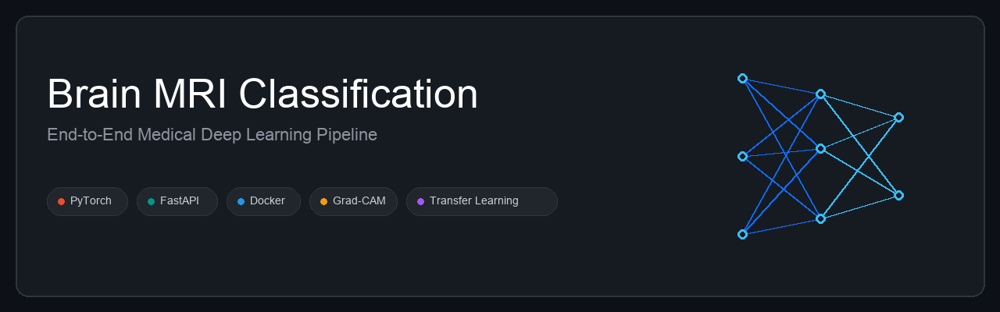

# 🧠 Brain Tumor MRI Classification

<p align="center">
  
</p>

<p align="center">
  
  
  
  
  
  
  
</p>

<p align="center">
  <b>Author:</b> <a href="https://github.com/Nafisioo">Nafise Bahoosh</a> · Production-Style Medical Imaging MLOps Project
</p>

<p align="center">
  <a href="#-overview">Overview</a> •
  <a href="#-live-demo">Live Demo</a> •
  <a href="#-architecture-and-deployment">Architecture</a> •
  <a href="#-dataset-and-data-pipeline">Dataset</a> •
  <a href="#-results-and-performance">Results</a> •
  <a href="#-interpretability-grad-cam">Interpretability</a> •
  <a href="#-project-structure">Structure</a> •
  <a href="#-getting-started">Getting Started</a> •
  <a href="#-roadmap">Roadmap</a>
</p>

---

## 📑 Overview

An end-to-end deep learning pipeline for **4-class brain MRI classification**, built with PyTorch. This project bridges the gap between research and production by covering the full machine learning lifecycle — from a custom baseline CNN, through fine-tuned transfer learning with ResNet18, to Grad-CAM interpretability checks and a Dockerized FastAPI microservice deployed through automated CI/CD.

### 🚀 Key Highlights

- **Model Development** — Custom CNN baselines plus transfer learning with ResNet18, reaching **97.78% test accuracy**.
- **Model Interpretability** — Grad-CAM visualizations confirm the model attends to clinically relevant tumor regions rather than background artifacts.
- **Production-Ready Deployment** — A concurrent REST API built with **FastAPI**, packaged with **Docker** for one-command deployment anywhere.
- **Automated MLOps (CI/CD)** — A GitHub Actions pipeline handles linting, testing against mock artifacts, and semantic-versioned image pushes to Docker Hub on every tagged release.

---

## 🚀 Live Demo

> 🔜 **In progress** — a hosted, interactive demo (Hugging Face Spaces or Render) is being set up so you can upload an MRI scan and get a live prediction with a Grad-CAM overlay, no local setup required.

Until then, the full stack runs locally in under a minute — jump to [Getting Started](#-getting-started).

---

## 🏗️ Architecture and Deployment

This repository uses a tag-triggered continuous deployment workflow. Pushing a new Git tag (e.g. `v1.0.1`) automatically builds the production FastAPI Docker image and publishes it to Docker Hub.


---

## 💾 Dataset and Data Pipeline

The model is trained on a multi-class brain MRI dataset available on [Hugging Face — LuminaAI/Brain-MRI-Classification](https://huggingface.co/datasets/LuminaAI/Brain-MRI-Classification).

- **Classes:** `Glioma`, `Meningioma`, `Pituitary Tumor`, `No Tumor`
- **Total Images:** 13,060

### Splitting & Validation Strategy

Training and validation sets are split with `StratifiedShuffleSplit`, keeping the class distribution of all four tumor types balanced across both splits. A custom `TransformSubset` wrapper applies fully independent transform pipelines to the train and validation sets, even though both draw from the same underlying dataset.

### Medical-Safe Data Augmentation

Augmentations are kept intentionally mild to avoid distorting pathological features. The training pipeline applies:

- Resize to the target input size
- Random horizontal flip (50% probability)
- Random rotation up to 8°, with bilinear interpolation
- Color jitter, up to 10% on brightness and contrast

### Adaptive Normalization

Preprocessing adapts to the architecture being trained. Custom CNNs trained from scratch use dataset-specific normalization (`mean: 0.2176`, `std: 0.2026`); transfer-learning runs switch automatically to standard ImageNet statistics. A custom `ImageFolderWithPaths` wrapper returns the file path alongside each image tensor and label, keeping evaluation results traceable back to source files.

---

## 📊 Results and Performance

The fine-tuned ResNet18 clearly outperforms the custom baselines, showing the value of transfer learning on this dataset.

| Model | Accuracy | Precision | Recall | F1 Score | Test Loss |
|---|---|---|---|---|---|
| CNN Baseline V1 | 81.12% | 82.73% | 81.21% | 81.15% | 0.528 |
| CNN Baseline V2 | 96.41% | 96.43% | 96.80% | 96.55% | 0.128 |
| ResNet18 (Feature Extraction) | 81.80% | 82.05% | 81.89% | 81.88% | 0.458 |
| **ResNet18 (Fine-Tuned)** | **97.78%** | **98.04%** | **98.00%** | **98.01%** | **0.066** |

---

## 🔍 Interpretability (Grad-CAM)

Trust matters in medical AI. Grad-CAM traces the gradients flowing into the final convolutional layer to highlight exactly which regions of each MRI scan drove the model's prediction — a direct way to check the model is keying off tumor tissue rather than scanner artifacts, skull shape, or background noise.

---

## 📁 Project Structure

```
brain-tumor-classification/
├── .github/
│   └── workflows/
│       ├── ci.yml              # Lint + test on every push/PR
│       └── cd.yml              # Build & push Docker image on tagged release
├── assets/
│   └── banner.png
├── data/                       # Dataset (not committed — see Dataset section)
├── models/                     # Saved model checkpoints
├── main.py                     # FastAPI inference service
├── train.py                    # Custom CNN baseline training
├── train_resnet18.py           # ResNet18 feature extraction
├── train_resnet18_finetune.py  # ResNet18 fine-tuning
├── Dockerfile
├── requirements-dev.txt
├── LICENSE
└── README.md
```

> Adjust paths above if your local layout differs slightly.

---

## ⚙️ Getting Started

### Option 1 — Run with Docker (recommended)

Pull the latest pre-built image and start the API in two commands:

```bash
# Pull the latest release from Docker Hub
docker pull nafiseh/brain-tumor-api:latest

# Run the container on port 8000
docker run -d -p 8000:8000 nafiseh/brain-tumor-api:latest
```

### Option 2 — Local Development

```bash
git clone https://github.com/Nafisioo/brain-tumor-classification.git
cd brain-tumor-classification

python -m venv .venv
source .venv/bin/activate
pip install -r requirements-dev.txt
```

Train the models locally:

```bash
# Custom CNN baseline
python train.py

# ResNet18 — feature extraction, then fine-tuning
python train_resnet18.py
python train_resnet18_finetune.py
```

---

## 🌐 API Reference

Once the container is running, the service is available at `http://127.0.0.1:8000`.

```bash
# Health check
curl http://127.0.0.1:8000/health

# Inference request
curl -X POST http://127.0.0.1:8000/predict \
  -H "accept: application/json" \
  -H "Content-Type: multipart/form-data" \
  -F "file=@sample_mri.png;type=image/png"
```

Interactive Swagger UI documentation is generated automatically at `http://127.0.0.1:8000/docs` while the server is running.

---

## 🗺️ Roadmap

- [x] **CI/CD** — GitHub Actions for automated testing and Docker Hub publishing
- [x] **Containerization** — Production-ready Docker image for the FastAPI service
- [ ] **Live Demo** — Hosted inference UI on Hugging Face Spaces or Render
- [ ] **Advanced Architectures** — Evaluate EfficientNet-B3 and Vision Transformers (ViT)
- [ ] **Mixed Precision Training** — Add PyTorch AMP for faster training
- [ ] **Experiment Tracking** — Integrate MLflow for run tracking and a model registry

---

## 📄 License

This project is licensed under the MIT License — see [LICENSE](LICENSE) for details.

---

## 📬 Contact

Built and maintained by **[Nafise Bahoosh](https://github.com/Nafisioo)**. Issues, pull requests, and suggestions are welcome — feel free to open one on this repository.