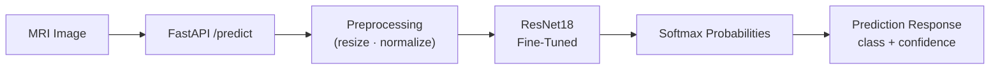
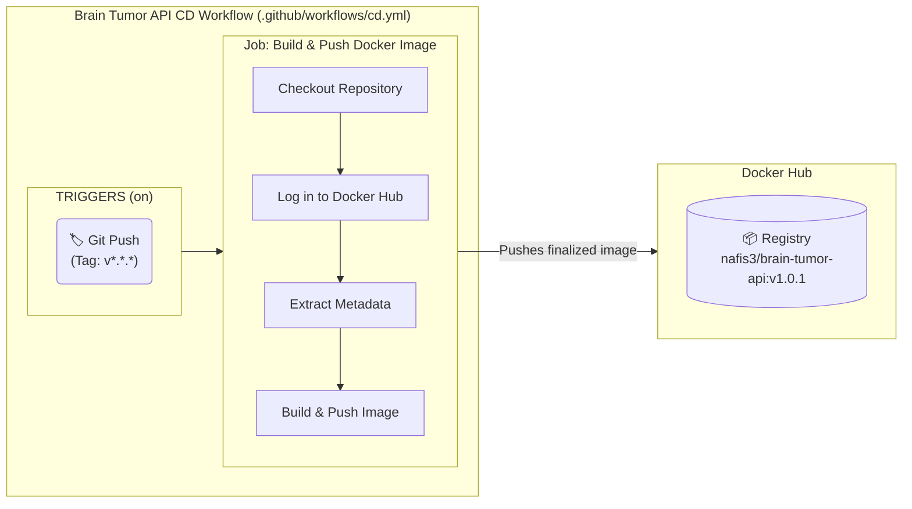
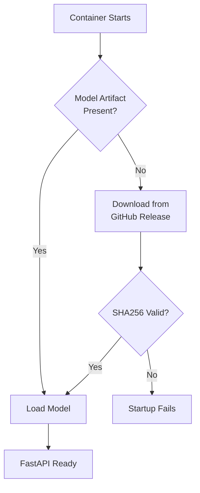

# 🧠 Brain Tumor MRI Classification

<p align="center">
  
</p>

<p align="center">
  
  
  
  
  
  
</p>

<p align="center">
  <b>Author:</b> <a href="https://github.com/Nafisioo">Nafise Bahoosh</a> · Production-Style Medical Imaging MLOps Project
</p>

<p align="center">
  <a href="#-overview">Overview</a> •
  <a href="#-live-demo">Live Demo</a> •
  <a href="#-architecture-and-deployment">Architecture</a> •
  <a href="#-dataset-and-data-pipeline">Dataset</a> •
  <a href="#-results-and-performance">Results</a> •
  <a href="#-interpretability-grad-cam">Interpretability</a> •
  <a href="#-model-release-and-versioning">Model Release</a> •
  <a href="#-project-structure">Structure</a> •
  <a href="#-getting-started">Getting Started</a> •
  <a href="#-api-reference">API</a> •
  <a href="#-testing-and-code-quality">Testing</a> •
  <a href="#-roadmap">Roadmap</a>
</p>

---

## 📑 Overview

An end-to-end deep learning system for **4-class brain MRI classification**, built with PyTorch and deployed as a production-style FastAPI service. The project covers the full lifecycle: dataset validation and reproducible splitting, a custom CNN baseline, transfer learning and fine-tuning with ResNet18, Grad-CAM interpretability checks, an automated Pytest suite, and a Dockerized API with versioned model releases shipped through GitHub Actions CI/CD.

### 🚀 Key Highlights

- **Model** — Custom CNN baselines and a fine-tuned ResNet18 reaching **97.78% accuracy / 98.01% F1** on the test set.
- **Interpretability** — Grad-CAM confirms the model attends to tumor tissue rather than background artifacts.
- **Production API** — FastAPI service with a separate `api/` (routing, schemas) and `inference/` (model loading, prediction) layer, backed by an automated Pytest suite.
- **MLOps** — GitHub Actions CI (lint, test, Docker build, health check) and tag-triggered CD that publishes versioned images to Docker Hub. Model checkpoints ship as versioned GitHub Releases, downloaded and SHA256-verified at container startup.

---

## 🚀 Live Demo

> 🔜 **In progress** — a hosted, interactive demo (Hugging Face Spaces or Render) is being set up so you can upload an MRI scan and get a live prediction with a Grad-CAM overlay, no local setup required.

Until then, the full stack runs locally in under a minute — jump to [Getting Started](#-getting-started).

---

## 🏗️ Architecture and Deployment

### Request Flow



### Continuous Integration (CI)

Every push and pull request runs the test suite, then builds the Docker image and runs a live health check against it before tearing it down — catching breakages before they ever reach `main`.

<p align="center">
  
</p>

### Continuous Deployment (CD)

Pushing a new Git tag (e.g. `v1.0.1`) automatically builds the production FastAPI Docker image and publishes it to Docker Hub.



---

## 💾 Dataset and Data Pipeline

The model is trained on a multi-class brain MRI dataset available on [Hugging Face — LuminaAI/Brain_Tumor_MRI_4c_Aug_Split](https://huggingface.co/datasets/LuminaAI/Brain_Tumor_MRI_4c_Aug_Split).

- **Classes:** `Glioma`, `Meningioma`, `Pituitary Tumor`, `No Tumor`
- **Total Images:** 13,060

### Splitting & Validation Strategy

Training and validation sets are split with `StratifiedShuffleSplit`, keeping the class distribution of all four tumor types balanced across both splits. A custom `TransformSubset` wrapper applies fully independent transform pipelines to the train and validation sets, even though both draw from the same underlying dataset.

### Medical-Safe Data Augmentation

Augmentations are kept intentionally mild to avoid distorting pathological features. The training pipeline applies:

- Resize to the target input size
- Random horizontal flip (50% probability)
- Random rotation up to 8°, with bilinear interpolation
- Color jitter, up to 10% on brightness and contrast

### Adaptive Normalization

Preprocessing adapts to the architecture being trained. Custom CNNs trained from scratch use dataset-specific normalization (`mean: 0.2176`, `std: 0.2026`); transfer-learning runs switch automatically to standard ImageNet statistics (`mean: [0.485, 0.456, 0.406]`, `std: [0.229, 0.224, 0.225]`). A custom `ImageFolderWithPaths` wrapper returns the file path alongside each image tensor and label, keeping evaluation results traceable back to source files.

---

## 📊 Results and Performance

The fine-tuned ResNet18 clearly outperforms the custom baselines, showing the value of transfer learning on this dataset.

| Model | Accuracy | Precision | Recall | F1 Score | Test Loss |
|---|---|---|---|---|---|
| CNN Baseline V1 | 81.12% | 82.73% | 81.21% | 81.15% | 0.528 |
| CNN Baseline V2 | 96.41% | 96.43% | 96.80% | 96.55% | 0.128 |
| ResNet18 (Feature Extraction) | 81.80% | 82.05% | 81.89% | 81.88% | 0.458 |
| **ResNet18 (Fine-Tuned)** | **97.78%** | **98.04%** | **98.00%** | **98.01%** | **0.066** |

---

## 🔍 Interpretability (Grad-CAM)

Trust matters in medical AI. Grad-CAM traces the gradients flowing into the final convolutional layer to highlight exactly which regions of each MRI scan drove the model's prediction — a direct way to check the model is keying off tumor tissue rather than scanner artifacts, skull shape, or background noise.

<p align="center">
  
</p>

> Grad-CAM is a qualitative sanity check, not proof of clinical validity — see the [disclaimer](#-medical-disclaimer) below.

---

## 🧠 Model Release and Versioning

The trained checkpoint is distributed separately from the Git repository via **versioned GitHub Releases**, rather than committed directly, keeping the repo lightweight. On container startup, the app checks for the model artifact locally, downloads the matching release if it's missing, and verifies it against a SHA256 checksum before the API is allowed to start.



---

## 📁 Project Structure

```
brain-tumor-classification/
├── .github/
│   └── workflows/
│       ├── ci.yml               # Lint + test + Docker build/health-check on push/PR
│       └── cd.yml               # Build & push Docker image on tagged release
├── api/                         # FastAPI app: routes, schemas, middleware, startup
│   ├── main.py
│   ├── config.py
│   ├── schemas.py
│   ├── middleware.py
│   ├── exceptions.py
│   └── logger.py
├── inference/                   # Model loading & prediction logic
│   ├── predictor.py
│   └── preprocessing.py
├── src/                         # Training source
│   ├── models/                  # CNN baselines, ResNet18, model factory
│   ├── training/                # Trainer, evaluator, checkpointing
│   └── utils/                   # Device, seed, metrics, history helpers
├── configs/                     # Training & path configuration
├── tests/                       # Pytest suite
│   ├── conftest.py
│   ├── test_api.py
│   ├── test_health.py
│   ├── test_model.py
│   └── test_prediction.py
├── scripts/
│   ├── download_checkpoint.py
│   ├── download_model.sh
│   ├── entrypoint.sh
│   ├── generate_banner.py
│   ├── generate_readme_asset.py
│   └── setup_model.sh
├── notebooks/                   # Exploration & evaluation notebooks (01–08)
├── experiments/                 # Per-model checkpoints, logs & results
├── artifacts/                   # Trained model + metrics (local)
├── release/                     # Versioned model artifacts (GitHub Releases)
├── outputs/                     # Generated figures, metrics, predictions
├── assets/                      # README images
├── train.py
├── train_resnet18.py
├── train_resnet18_finetune.py
├── evaluate.py
├── resnet_evaluate.py
├── Dockerfile
├── docker-compose.yml
├── requirements.txt
├── requirements-dev.txt
├── pyproject.toml
├── pytest.ini
├── LICENSE
└── README.md
```

---

## ⚙️ Getting Started

### Option 1 — Docker (recommended)

```bash
# Pull the latest release from Docker Hub
docker pull nafis3/brain-tumor-api:latest

# Run the container on port 8000
docker run -d --name brain-tumor-api -p 8000:8000 nafis3/brain-tumor-api:latest
```

The container checks for the model artifact, downloads and SHA256-verifies it if missing, then starts FastAPI — see [Model Release and Versioning](#-model-release-and-versioning).

### Option 2 — Docker Compose

```bash
docker compose up -d
docker ps                        # should show "Up ... (healthy)"
docker compose logs -f brain-tumor-api
docker compose down
```

### Option 3 — Local Development

```bash
git clone https://github.com/Nafisioo/brain-tumor-classification.git
cd brain-tumor-classification

python -m venv .venv
source .venv/bin/activate
pip install -r requirements-dev.txt   # installs requirements.txt + test/lint tools
```

Train the models locally:

```bash
# Custom CNN baseline
python train.py

# ResNet18 — feature extraction, then fine-tuning
python train_resnet18.py
python train_resnet18_finetune.py
```

---

## 🌐 API Reference

Once running, the service is available at `http://127.0.0.1:8000`.

### Health Check

```bash
curl http://127.0.0.1:8000/health
```

```json
{ "status": "healthy" }
```

### Prediction

```bash
curl -X POST http://127.0.0.1:8000/predict \
  -H "accept: application/json" \
  -H "Content-Type: multipart/form-data" \
  -F "file=@sample_mri.png;type=image/png"
```

```json
{
  "class_name": "glioma",
  "confidence": 0.9821,
  "probabilities": {
    "glioma": 0.9821,
    "meningioma": 0.0102,
    "no_tumor": 0.0021,
    "pituitary": 0.0056
  }
}
```

Interactive Swagger UI docs are generated automatically at `http://127.0.0.1:8000/docs`.

---

## 🧪 Testing and Code Quality

```bash
# Run the full test suite
pytest

# With coverage
pytest --cov=api --cov=inference --cov-report=term-missing

# Formatting and linting
black --check .
flake8 api inference tests
```

---

## 🗺️ Roadmap

- [x] **CI/CD** — GitHub Actions for automated testing, Docker build/health-check, and Docker Hub publishing
- [x] **Containerization** — Production Docker image with Compose support
- [x] **Model Versioning** — GitHub Releases with SHA256-verified downloads at startup
- [ ] **Live Demo** — Hosted inference UI on Hugging Face Spaces or Render
- [ ] **Advanced Architectures** — Evaluate EfficientNet-B3 and Vision Transformers (ViT)
- [ ] **Mixed Precision Training** — Add PyTorch AMP for faster training
- [ ] **Experiment Tracking** — Integrate MLflow for run tracking and a model registry

---

## ⚠️ Medical Disclaimer

This project is intended for **educational, research, and software-engineering purposes only**. It is **not a medical device** and must not be used to diagnose, treat, or make clinical decisions about patients. Reported metrics reflect performance on this project's evaluation dataset and should not be interpreted as evidence of clinical validity or generalization to real-world patient populations.

---

## 📄 License

This project is licensed under the MIT License — see [LICENSE](LICENSE) for details.

---

## 📬 Contact

Built and maintained by **[Nafise Bahoosh](https://github.com/Nafisioo)**. Issues, pull requests, and suggestions are welcome — feel free to open one on this repository.